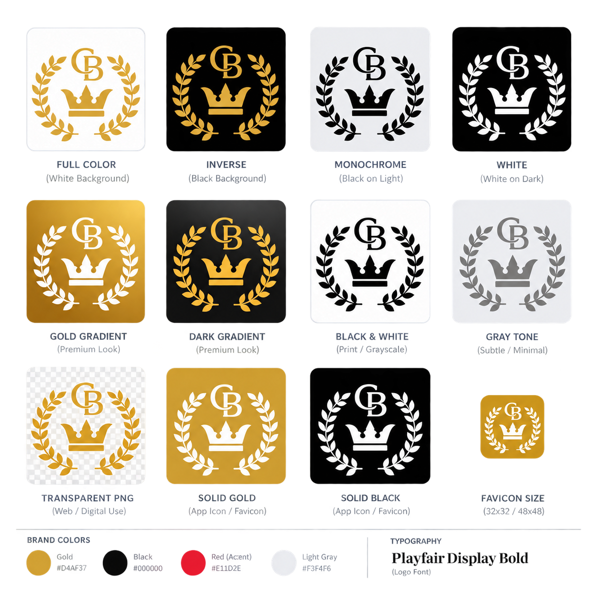

# championbullies

An e-commerce style dog adoption platform with gallery, reservation modal, and knowledge graph generation.

## Features

- **Dog Gallery** — Browse available dogs with images, details, and "Reserve Now" buttons
- **Reservation Modal** — Step-by-step multi-step reservation wizard (4 steps: Puppy Details → Contact → Living Situation → Agreement & Deposit)
- **Knowledge Graph** — Generate graphify knowledge graphs from codebase
- **Multi-step Form** — Zod-validated forms with react-hook-form integration
- **Context API** — Global reservation state management
- **GHL (GoHighLevel) Integration** — Automatically create contacts and deals in GHL when reservations are submitted. Configure via `GHL_API_KEY` and `GHL_LOCATION_ID` environment variables.



## Getting Started

First, run the development server:

```bash
pnpm dev
# or
npm run dev
# or
yarn dev
```

Open [http://localhost:3000](http://localhost:3000) with your browser to see the result.

You can start editing the page by modifying `app/page.tsx`. The page auto-updates as you edit the file.

## Available Scripts

| Script | Description |
|--------|-------------|
| `pnpm dev` | Run development server |
| `pnpm build` | Build for production |
| `pnpm start` | Start production server |
| `pnpm graphify` | Generate knowledge graph |
| `pnpm graphify:build` | Build graphify wiki |

## Tech Stack

- [Next.js 16](https://nextjs.org) — React framework
- [React 19](https://react.dev) — UI library
- [Tailwind CSS](https://tailwindcss.com) — Styling
- [TypeScript](https://typescriptlang.org) — Type safety
- [Zod](https://zod.dev) — Schema validation
- [react-hook-form](https://react-hook-form.com) — Form management
- [Framer Motion](https://framer.com/motion) — Animations
- [gsap](https://greensock.com) — Animations

## Knowledge Graph

Generate a knowledge graph from the codebase:

```bash
pnpm graphify
```

This will create wiki-style markdown files in `src/app/graphify-out/wiki/` based on your code analysis.

## Deploy on Vercel

The easiest way to deploy your Next.js app is to use the [Vercel Platform](https://vercel.com/new?utm_medium=default-template&filter=next.js&utm_source=create-next-app&utm_campaign=create-next-app-readme) from the creators of Next.js.

## License

MIT
